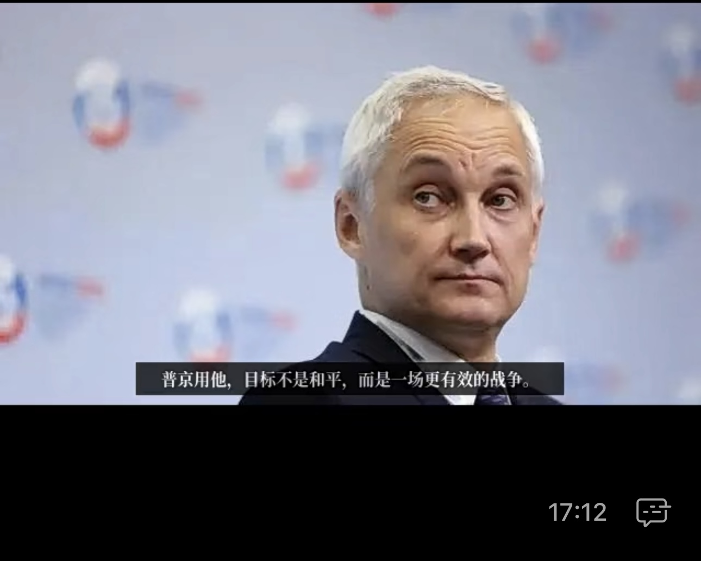

# 纯粹 Python 构建的文章转视频神器
运用 Python 代码，便能方便地将图文并茂的网页文章转换成视频。

## 具体步骤
- 通过 requests 获取文章内容
- 借 edge-tts 生成语音及字幕
- 利用 BeautifulSoap 抓取文章图像
- 再借助 moviepy 将图像拼接为视频，并匹配语音与字幕

## 项目特点
- 完全基于 Python 及其第三方应用库，无需依赖于stable-diffusion/midjourney等大模型。
- 实现以微信公众号文章为例，函数的具体查询是基于公众号文章的特点 (如 make_audio.py 里的 get_title / get_wechat_article 等函数)。若用于其它类型文章，可能需要调整查询的tag和class信息

## 开发环境
Windows 11, WSL2 + Rocky 9.3，Python 3.12

安装 Rocky Linux 9.3 for Windows Subsystem for Linux 2 (WSL2), refer to [link](https://docs.rockylinux.org/guides/interoperability/import_rocky_to_wsl/)

```Windows PowerShell
wget -Uri https://dl.rockylinux.org/pub/rocky/9/images/x86_64/Rocky-9-Container-Base.latest.x86_64.tar.xz -OutFile ./Rocky-9-Container-Base.latest.x86_64.tar.xz
mkdir wsl-rocky
wsl --import rocky9 ./wsl-rocky ./Rocky-9-Container-Base.latest.x86_64.tar.xz --version 2
wsl -d rocky9
```

升级系统，添加普通用户
```bash
# dnf install epel-release
# dnf update && dnf upgrade
#
# dnf install sudo
# adduser wsl
# passwd wsl
# usermod -aG wheel wsl
# exit
```

以普通用户进入 Rocky9
```Windows PowerShell
wsl -d rocky9 -u wsl
```

安装 pip 和 ImageMagick

```bash
sudo dnf install python3-pip
sudo dnf install ImageMagick
sudo dnf install git vim
```

准备 sandbox (要求 pub key 已经在 GitHub 账户 Profile 设置好)

```bash
cd ~/
mkdir sandbox
cd sandbox
git clone git@github.com:sim4d/text2video.git text2video
```


安装依赖

```bash
cd ~/sandbox/text2video
python3 -m venv my_venv
source ./my_venv/bin/activate
pip3 install -r requirements.txt
```

设置url，运行text2video.py

```
python3 text2video.py
```

## References
- https://zulko.github.io/moviepy/ref/ref.html
- https://github.com/rany2/edge-tts

## 其它问题
### 1. edge-tts 生成 vtt 字幕时，只能以词语为 Boundary
做成视频后，字幕看起来就很乱。如图


#### 解决方案
把 edge-tts 项目导入进来，并打上patch，改为以句子为 Boundary

Patch diff
```bash
$ diff -u communicate.py-original communicate.py
--- communicate.py-original     2024-05-12 16:28:58.031623420 +0800
+++ communicate.py      2024-05-13 00:20:53.785773846 +0800
@@ -331,7 +331,7 @@
                 "Content-Type:application/json; charset=utf-8\r\n"
                 "Path:speech.config\r\n\r\n"
                 '{"context":{"synthesis":{"audio":{"metadataoptions":{'
-                '"sentenceBoundaryEnabled":false,"wordBoundaryEnabled":true},'
+                '"sentenceBoundaryEnabled":true,"wordBoundaryEnabled":false},'
                 '"outputFormat":"audio-24khz-48kbitrate-mono-mp3"'
                 "}}}}\r\n"
             )
@@ -359,7 +359,7 @@
         def parse_metadata() -> Dict[str, Any]:
             for meta_obj in json.loads(data)["Metadata"]:
                 meta_type = meta_obj["Type"]
-                if meta_type == "WordBoundary":
+                if meta_type in ("WordBoundary", "SentenceBoundary"):
                     current_offset = meta_obj["Data"]["Offset"] + offset_compensation
                     current_duration = meta_obj["Data"]["Duration"]
                     return {
```

新的字幕效果




### 2. 同样的代码，用 WSL + Ubuntu，就会碰到以下问题。换成 Ubuntu 24.04 也一样。最后换成 Rocky 9.3 才行。

```bash
Traceback (most recent call last):
  File "/home/wsl/sandbox/text2video/text2video.py", line 116, in <module>
    main(url, font_path)
  File "/home/wsl/sandbox/text2video/text2video.py", line 107, in main
    generate_video(images_dir, audio_path, vtt_path, font_path, output_path, front_txt, title_txt)
  File "/home/wsl/sandbox/text2video/text2video.py", line 36, in generate_video
    front_clip = mp.TextClip(front_txt, color='black', bg_color='white', font=font_path, align='West', kerning=5, fontsize=18)
                 ^^^^^^^^^^^^^^^^^^^^^^^^^^^^^^^^^^^^^^^^^^^^^^^^^^^^^^^^^^^^^^^^^^^^^^^^^^^^^^^^^^^^^^^^^^^^^^^^^^^^^^^^^^^^^
  File "/home/wsl/sandbox/text2video/my_venv/lib/python3.12/site-packages/moviepy/video/VideoClip.py", line 1146, in __init__
    raise IOError(error)
OSError: MoviePy Error: creation of None failed because of the following error:

convert-im6.q16: attempt to perform an operation not allowed by the security policy `@/tmp/tmpn53ke08b.txt' @ error/property.c/InterpretImageProperties/3771.
convert-im6.q16: label expected `@/tmp/tmpn53ke08b.txt' @ error/annotate.c/GetMultilineTypeMetrics/782.
convert-im6.q16: no images defined `PNG32:/tmp/tmp3vlxrrq6.png' @ error/convert.c/ConvertImageCommand/3234.
.

.This error can be due to the fact that ImageMagick is not installed on your computer, or (for Windows users) that you didn't specify the path to the ImageMagick binary in file conf.py, or that the path you specified is incorrect
```
#### 解决方案
这可能是 Windows + Python + ImageMagick 特有的问题，好像这个 [link](https://www.toymoban.com/news/detail-486297.html) 碰到类似问题，并成功解决了。

## 扫描试用
微信扫码


## License: MIT
本项目采用 MIT 许可证授权。
